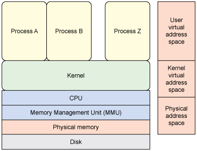

# What is Docker?

Docker is tooling for **OS-Level** Virtualization †

(Helpful background from [IBM Docs](https://www.ibm.com/developerworks/library/l-kernel-memory-access/index.html)
on Linux kernel vs. userspace. Note that this isn't about Docker at all.)

† on Linux. OS X has a Virtual Machine layer
