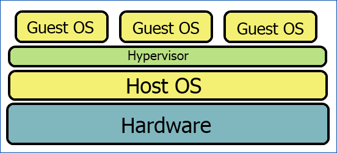

# What is Docker?

Docker is tooling for **OS-Level** Virtualization

(Helpful background from [IBM Docs](https://www.ibm.com/developerworks/library/l-kernel-memory-access/index.html) on Linux kernel vs. userspace. Note that this isn't about Docker at all.)

See how the Kernel manages all those processes? Modern Linux kernels provide a lot of low-level tools to manage and isolate them. Two examples:

* [namespaces](https://en.wikipedia.org/wiki/Linux_namespaces) - groups of process IDs, user IDs, network access, filesystems can see only each other, and not those in other namespaces.
* [cgroups](https://en.wikipedia.org/wiki/Cgroups) - limits and isolates resource usage (e.g. CPU) of processes

Docker uses these underlying kernel features to run *containers* at native speed but isolated from each other. [From Docker](https://www.docker.com/what-container):

Notice that there's just one kernel. Each container is a group of processes that are isolated from the other containers, but they're running natively against the kernel, and not through a virtualization layer. There are even three Linux distros in there, but all using the same kernel. This is in contrast to the way, say, [VirtualBox works](https://www.howtogeek.com/66734/htg-explains-what-is-a-hypervisor/), which emulates an entire guest operating system (including the kernel):

However, note that this all applies to *Linux*, where Docker got its start. On OS X, which doesn't use a Linux kernel, Docker for Mac sets up a virtualized Linux layer that Docker can run on top of.